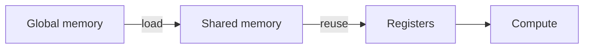

A **reference of the reusable components** available for writing notes on this site.

Each section shows the intended markup and how it renders. Components are designed to degrade gracefully: content stays readable even if JavaScript fails.

## Contents

<div class="ia-toc" markdown="1">

- [Callouts](#callouts)
- [Sidenotes](#sidenotes)
- [Tooltips](#tooltips)
- [Citations](#citations)
- [Tabs](#tabs)
- [Code & copy](#code-copy)
- [Mermaid diagrams](#mermaid)
- [Statements](#statements)
- [Quote](#quotes)
- [Checklist](#todo)
- [Toggles](#toggles)
- [Figures](#figures)
- [Margin figure](#marginfig)
- [Side-by-side](#sidebyside)
- [Math](#math)
- [Stepper](#stepper)
- [Tables](#tables)
- [References](#references)

</div>

---

<section class="ia-section" id="callouts" markdown="1">
  <div class="ia-section__header">
    <h2>Callouts</h2>
  </div>

Four kinds - `info` (default), `tip`, `warn`, `danger`. Use sparingly; a note that leans on callouts stops feeling like an essay.


Callouts use a left rule and a small-caps label. No emoji, no fill.




Prefer `torch.compile` once a kernel is stable - the overhead is paid per first run.




`torch.cuda.synchronize()` will silently hide launch-latency regressions if you wrap all your timings with it.




Do not `rm -rf` the wandb runs directory while a sweep is still writing.



</section>

---

<section class="ia-section" id="sidenotes" markdown="1">
  <div class="ia-section__header">
    <h2>Sidenotes</h2>
  </div>

On desktop widths the note floats into the right margin, and the paragraph continues without interruption. Use them for pointer-level remarks: citations, caveats, a nudge to see a related note.

</section>

---

<section class="ia-section" id="tooltips" markdown="1">
  <div class="ia-section__header">
    <h2>Tooltips</h2>
  </div>

Define a term inline like  without breaking the paragraph. Hover or focus reveals the definition.

</section>

---

<section class="ia-section" id="citations" markdown="1">
  <div class="ia-section__header">
    <h2>Citations</h2>
  </div>

Drop inline references like  in the middle of a sentence. The bubble appears on hover or focus and contains a short summary plus a link.

</section>

---

<section class="ia-section" id="tabs">
  <div class="ia-section__header">
    <h2>Tabs</h2>
  </div>

  <div class="ia-tabs" id="tabs-demo">
    <div class="ia-tabs__tablist" role="tablist" aria-label="Demo tabs">
      <button class="ia-tabs__tab" role="tab" aria-controls="tabs-demo-panel-0" aria-selected="true" type="button">C++</button>
      <button class="ia-tabs__tab" role="tab" aria-controls="tabs-demo-panel-1" aria-selected="false" type="button">Python</button>
    </div>

    <div class="ia-tabs__panel" id="tabs-demo-panel-0" role="tabpanel">
      
#include <iostream>

int main() {
  std::cout << "hello" << std::endl;
  return 0;
}
      
    </div>

    <div class="ia-tabs__panel" id="tabs-demo-panel-1" role="tabpanel" hidden>
      
def main() -> None:
    print("hello")


if __name__ == "__main__":
    main()
      
    </div>
  </div>

Arrow-key navigation works inside the tablist.

</section>

---

<section class="ia-section" id="code-copy" markdown="1">
  <div class="ia-section__header">
    <h2>Code &amp; copy</h2>
  </div>

Hover a code block to reveal the copy button.

```rust
fn main() {
    println!("Hello, world!");
}
```

</section>

---

<section class="ia-section" id="mermaid" markdown="1">
  <div class="ia-section__header">
    <h2>Mermaid diagrams</h2>
  </div>



</section>

---

<section class="ia-section" id="statements" markdown="1">
  <div class="ia-section__header">
    <h2>Statements</h2>
  </div>

Three kinds: `definition`, `theorem` / `lemma`, and `proof`.

  
  **Softmax.** $\sigma(x)_i = \exp(x_i) / \sum_j \exp(x_j)$.
  
  

  
  If $A$ is symmetric positive definite, then it admits a Cholesky factorization $A = LL^\top$ with $L$ lower triangular and $L_{ii} > 0$.
  
  

  
  Induct on matrix size. Split $A$ with a Schur complement; the complement inherits SPD and yields $L$ by induction.
  
  

</section>

---

<section class="ia-section" id="quotes" markdown="1">
  <div class="ia-section__header">
    <h2>Quote</h2>
  </div>

  

</section>

---

<section class="ia-section" id="todo" markdown="1">
  <div class="ia-section__header">
    <h2>Checklist</h2>
  </div>

  
  - [ ] Verify shapes match
  - [ ] Add ablation table
  - [x] Reproduce baseline
  - [x] Freeze random seed for reproducibility
  
  

</section>

---

<section class="ia-section" id="toggles" markdown="1">
  <div class="ia-section__header">
    <h2>Toggles</h2>
  </div>

  
  <details>
    <summary><strong>Assumptions</strong></summary>

    - i.i.d. data
    - bounded gradients
  </details>

  <details>
    <summary><strong>Implementation notes</strong></summary>

    Use mixed precision and fuse layernorm where possible.

    <details>
      <summary><strong>Nested - micro-optimizations</strong></summary>

      - fuse bias + activation
      - avoid unnecessary casts
    </details>
  </details>
  
  

</section>

---

<section class="ia-section" id="figures" markdown="1">
  <div class="ia-section__header">
    <h2>Figures</h2>
  </div>

Click to zoom into a lightbox; Escape or click outside dismisses.

  

### File links

Attach downloads inline: 

</section>

---

<section class="ia-section" id="marginfig" markdown="1">
  <div class="ia-section__header">
    <h2>Margin figure</h2>
  </div>

A small diagram that belongs in the right gutter on desktop and stacks inline on mobile - useful when a figure is supporting, not central.

  

This paragraph continues flowing in the main column while the figure sits alongside. Good for architecture diagrams that illustrate a single paragraph's point, small plots, or icon-sized schematics.

</section>

---

<section class="ia-section" id="sidebyside" markdown="1">
  <div class="ia-section__header">
    <h2>Side-by-side</h2>
  </div>

Two columns for before/after, input→output, or alternative formulations. Collapses to a stack below 900px.


```python
# imperative
total = 0
for x in xs:
    total += x * x
```



```python
# vectorised
total = (xs * xs).sum()
```




</section>

---

<section class="ia-section" id="math" markdown="1">
  <div class="ia-section__header">
    <h2>Math</h2>
  </div>

Inline: $C_{ij}=\sum_k A_{ik}B_{kj}$.

Block:

$$
\mathrm{FLOPs} \approx 2MNK
$$
</section>

---

<section class="ia-section" id="stepper" markdown="1">
  <div class="ia-section__header">
    <h2>Stepper</h2>
  </div>

Discrete steps - good for derivations, ablations, or walk-throughs.

<div class="ia-stepper" data-stepper>
  <div class="ia-stepper__controls"></div>
  <div class="ia-stepper__panel" data-step markdown="1">

**Step 1.** Start with a simple recurrence.

$$ a_{t} = \alpha\, a_{t-1} + x_t $$

  </div>
  <div class="ia-stepper__panel" data-step markdown="1" hidden>

**Step 2.** Each new token updates state.

The running average of past inputs is a linear combination governed by $\alpha$.

  </div>
  <div class="ia-stepper__panel" data-step markdown="1" hidden>

**Step 3.** Later outputs depend on stored information.

This is the essence of any recurrent model - the state is the memory.

  </div>
</div>

</section>

---

<section class="ia-section" id="tables" markdown="1">
  <div class="ia-section__header">
    <h2>Tables</h2>
  </div>

| Component       | Type    | Notes                                      |
|-----------------|---------|--------------------------------------------|
| Callout         | block   | `info` / `tip` / `warn` / `danger`         |
| Sidenote        | layout  | Margin on desktop, inline on mobile        |
| Tooltip         | inline  | Hover / focus bubble                       |
| Citation        | inline  | Same bubble, with a link                   |
| Tabs            | block   | Arrow keys navigate                        |
| Code + copy     | inline  | Hover a `<pre>` to reveal copy             |
| Mermaid         | diagram | Rendered client-side                       |
| Statement       | block   | Definition / theorem / proof               |
| Quote           | block   | Pull quote w/ attribution                  |
| Checklist       | block   | Strikes completed items                    |
| Toggles         | block   | Nestable `<details>`                       |
| Figure          | block   | Click to zoom                              |
| Margin figure   | layout  | Small figure in gutter                     |
| Side-by-side    | block   | 2-column, stacks below 900px               |
| Stepper         | widget  | Prev/Next panels                           |

</section>

---

<section class="ia-section" id="references" markdown="1">
  <div class="ia-section__header">
    <h2>References</h2>
  </div>

1. [Distill.pub - explorable explanations and interactive technical storytelling](https://distill.pub/)

</section>
