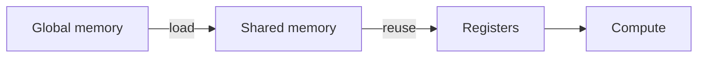

This page is a **kitchen sink for the interactive note components** available on this site.

Use it as a reference while writing new notes: each section shows one component, the expected markup, and the rendered behavior.

## Contents

<div class="ia-toc" markdown="1">

- [Sidenotes](#sidenotes)
- [Tooltips](#tooltips)
- [Tabs](#tabs)
- [Code + Copy](#code-copy)
- [Mermaid diagrams](#mermaid)
- [Interactive widgets](#widgets)
- [Citations](#citations)
- [Statements (definition/theorem/proof)](#statements)
- [Quotes](#quotes)
- [TODO / checklists](#todo)
- [Toggles / collapsible](#toggles)
- [Media + file links](#media)
- [Figures + zoom](#figures)
- [Math](#math)
- [Distill-ish extras](#distill-ish)
- [Horizontal scrollytelling](#scrolly)
- [Tables](#tables)
- [References](#references)

</div>

---

<section class="ia-section" id="sidenotes" markdown="1">
  <div class="ia-section__header">
    <h2>Sidenotes / margin notes</h2>
  </div>

  On desktop widths this becomes a margin note  and the paragraph continues.

  
</section>

---

<section class="ia-section" id="tooltips" markdown="1">
  <div class="ia-section__header">
    <h2>Tooltips</h2>
  </div>

  Define a term inline like
  
  without breaking the paragraph.

  
</section>

---

<section class="ia-section" id="tabs">
  <div class="ia-section__header">
    <h2>Tabs (code / variants)</h2>
  </div>

  <div class="ia-tabs" id="tabs-demo">
    <div class="ia-tabs__tablist" role="tablist" aria-label="Demo tabs">
      <button class="ia-tabs__tab" role="tab" aria-controls="tabs-demo-panel-0" aria-selected="true" type="button">C++</button>
      <button class="ia-tabs__tab" role="tab" aria-controls="tabs-demo-panel-1" aria-selected="false" type="button">Python</button>
    </div>

    <div class="ia-tabs__panel" id="tabs-demo-panel-0" role="tabpanel">
      
#include <iostream>

int main() {
  std::cout << "hello" << std::endl;
  return 0;
}
      
    </div>

    <div class="ia-tabs__panel" id="tabs-demo-panel-1" role="tabpanel" hidden>
      
def main() -> None:
    print("hello")


if __name__ == "__main__":
    main()
      
    </div>
  </div>

  
</section>

---

<section class="ia-section" id="code-copy" markdown="1">
  <div class="ia-section__header">
    <h2>Code blocks (+ Copy button)</h2>
  </div>

```bash
bundle exec jekyll serve
```

  
</section>

---

<section class="ia-section" id="mermaid" markdown="1">
  <div class="ia-section__header">
    <h2>Mermaid diagrams</h2>
  </div>



  
</section>

---

<section class="ia-section" id="widgets" markdown="1">
  <div class="ia-section__header">
    <h2>Interactive widgets (Web Components)</h2>
  </div>

  <h3 style="margin-top:0.8rem;">Runnable JS</h3>
  <js-runner title="Runnable JS demo">
    <template>
// Try editing and re-running
function fib(n){
  if(n<=1) return n;
  return fib(n-1)+fib(n-2);
}

for (let i=0;i<8;i++) {
  console.log(i, fib(i));
}
    </template>
  </js-runner>

  
</section>

---

<section class="ia-section" id="citations" markdown="1">
  <div class="ia-section__header">
    <h2>Citations (hover bubble)</h2>
  </div>

  You can drop citations inline like  in the middle of a sentence.

</section>

---

<section class="ia-section" id="statements" markdown="1">
  <div class="ia-section__header">
    <h2>Statements (definition / theorem / proof)</h2>
  </div>

  
  **Softmax:** $\\sigma(x)_i = \exp(x_i) / \sum_j \exp(x_j)$.
  
  

  
  If $A$ is symmetric positive definite, then it has a Cholesky factorization $A = LL^T$.
  
  

  
  Sketch: apply induction on matrix size and use Schur complements.
  
  

</section>

---

<section class="ia-section" id="quotes" markdown="1">
  <div class="ia-section__header">
    <h2>Quote block</h2>
  </div>

  

</section>

---

<section class="ia-section" id="todo" markdown="1">
  <div class="ia-section__header">
    <h2>TODO / checklists</h2>
  </div>

  
  - [ ] Verify shapes match
  - [ ] Add ablation table
  - [x] Reproduce baseline
  - [x] Freeze random seed for reproducibility
  
  

</section>

---

<section class="ia-section" id="toggles" markdown="1">
  <div class="ia-section__header">
    <h2>Toggle lists (accordion)</h2>
  </div>

  
  <details>
    <summary><strong>Assumptions</strong></summary>
    
    - i.i.d. data
    - bounded gradients
  </details>
  
  <details>
    <summary><strong>Implementation notes</strong></summary>
    
    Use mixed precision and fuse layernorm where possible.

    <details>
      <summary><strong>Nested toggle: micro-optimizations</strong></summary>
      
      - fuse bias + activation
      - avoid unnecessary casts
    </details>
  </details>
  
  

</section>

---

<section class="ia-section" id="media" markdown="1">
  <div class="ia-section__header">
    <h2>Media + file links</h2>
  </div>

  Images: use the existing figure component.

  Video:
  

  Audio:
  

  File link:
  

</section>

---

<section class="ia-section" id="figures" markdown="1">
  <div class="ia-section__header">
    <h2>Figures (click to zoom)</h2>
  </div>

  

  
</section>

---

<section class="ia-section" id="math" markdown="1">
  <div class="ia-section__header">
    <h2>Math ($\\LaTeX$)</h2>
  </div>

Inline: $C_{ij}=\sum_k A_{ik}B_{kj}$.

Block:

$$
\mathrm{FLOPs} \approx 2MNK
$$
</section>

---

<section class="ia-section" id="distill-ish" markdown="1">
  <div class="ia-section__header">
    <h2>Distill-ish extras</h2>
  </div>

### Hover citations

Here is a hover citation  in the middle of a sentence.

### Stepper (discrete interactive steps)

<div class="ia-stepper" data-stepper>
  <div class="ia-stepper__controls"></div>
  <div class="ia-stepper__panel" data-step markdown="1">

**Step 1:** Start with a simple recurrence.

$$ a_{t} = \alpha a_{t-1} + x_t $$

  </div>
  <div class="ia-stepper__panel" data-step markdown="1" hidden>

**Step 2:** Each new token updates state.

This is why step-by-step explanations help.

  </div>
  <div class="ia-stepper__panel" data-step markdown="1" hidden>

**Step 3:** Later outputs depend on stored information.

Use steppers for derivations or ablations.

  </div>
</div>

</section>

---

<section class="ia-section" id="scrolly" markdown="1">
  <div class="ia-section__header">
    <h2>Scrollytelling (drag-to-scrub sequence)</h2>
  </div>

This section demonstrates a single interaction: **drag your mouse over the sequence boxes** to scrub through tokens; the diagram (state + output) updates live.

<div class="ia-xscrolly" data-xscrolly data-tokens="12">
  <div class="ia-xscrolly__figure">
    <canvas width="720" height="260"></canvas>
    <div class="ia-xscrolly__hint">Drag left/right across the top sequence. (Touch works too.)</div>
  </div>
</div>

</section>

---

<section class="ia-section" id="tables" markdown="1">
  <div class="ia-section__header">
    <h2>Tables</h2>
  </div>

| Component | Type | Keyboard | Notes |
|---|---|---|---|
| Sidenote | layout | yes | Margin on desktop, inline on mobile |
| Tooltip | inline | yes | Hover/focus bubble |
| Mermaid | diagram | n/a | Rendered in browser |
| Runnable JS | widget | yes | Edit + run code inline |
| Drag scrolly | widget | yes | Pointer-drag on canvas |
| Statement | block | n/a | Definition / theorem / proof |
| Quote | block | n/a | Pull quote w/ attribution |
| TODO | block | n/a | Checklist container |
| File link | inline | yes | Download/link helper |

</section>

---

<section class="ia-section" id="references" markdown="1">
  <div class="ia-section__header">
    <h2>References</h2>
  </div>

- [1] [Distill.pub](https://distill.pub/) — explorable explanations and interactive technical storytelling.

</section>
