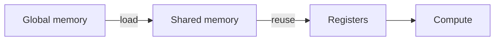

This page is a **collection of all interactive components** available in this site.

More components coming soon.

## Contents

- [Sidenotes](#sidenotes)
- [Tooltips](#tooltips)
- [Tabs](#tabs)
- [Code + Copy](#code-copy)
- [Mermaid diagrams](#mermaid)
- [Interactive widgets](#widgets)
- [Figures + zoom](#figures)
- [Details / collapsible](#details)
- [Math](#math)
- [Footnotes](#footnotes)
- [Distill-ish extras](#distill-ish)
- [Horizontal scrollytelling](#scrolly)
- [Tables](#tables)

---

<section class="ia-section" id="sidenotes" markdown="1">
  <div class="ia-section__header">
    <h2>Sidenotes / margin notes</h2>
  </div>

  On desktop widths this becomes a margin note
  
  and the paragraph continues.

  
</section>

---

<section class="ia-section" id="tooltips" markdown="1">
  <div class="ia-section__header">
    <h2>Tooltips</h2>
  </div>

  Define a term inline like
  
  without breaking the paragraph.

  
</section>

---

<section class="ia-section" id="tabs">
  <div class="ia-section__header">
    <h2>Tabs (code / variants)</h2>
  </div>

  <div class="ia-tabs" id="tabs-demo">
    <div class="ia-tabs__tablist" role="tablist" aria-label="Demo tabs">
      <button class="ia-tabs__tab" role="tab" aria-controls="tabs-demo-panel-0" aria-selected="true" type="button">C++</button>
      <button class="ia-tabs__tab" role="tab" aria-controls="tabs-demo-panel-1" aria-selected="false" type="button">Python</button>
      <button class="ia-tabs__tab" role="tab" aria-controls="tabs-demo-panel-2" aria-selected="false" type="button">CUDA</button>
    </div>

    <div class="ia-tabs__panel" id="tabs-demo-panel-0" role="tabpanel">
      
      #include <iostream>
      int main(){ std::cout << "hello" << std::endl; }
      
    </div>

    <div class="ia-tabs__panel" id="tabs-demo-panel-1" role="tabpanel" hidden>
      
      print("hello")
      
    </div>

    <div class="ia-tabs__panel" id="tabs-demo-panel-2" role="tabpanel" hidden>
      
      // pseudo-ish: kernel<<<grid, block>>>(...)
      
    </div>
  </div>

  
</section>

---

<section class="ia-section" id="code-copy" markdown="1">
  <div class="ia-section__header">
    <h2>Code blocks (+ Copy button)</h2>
  </div>

```bash
bundle exec jekyll serve
```

  
</section>

---

<section class="ia-section" id="mermaid" markdown="1">
  <div class="ia-section__header">
    <h2>Mermaid diagrams</h2>
  </div>



  
</section>

---

<section class="ia-section" id="widgets" markdown="1">
  <div class="ia-section__header">
    <h2>Interactive widgets (Web Components)</h2>
  </div>

  <h3 style="margin-top:0.8rem;">1) Slider-driven diagram</h3>
  <tile-matmul-demo size="8"></tile-matmul-demo>

  <h3>2) Runnable JS</h3>
  <js-runner title="Runnable JS demo">
    <template>
// Try editing and re-running
function fib(n){
  if(n<=1) return n;
  return fib(n-1)+fib(n-2);
}

for (let i=0;i<8;i++) {
  console.log(i, fib(i));
}
    </template>
  </js-runner>

  
</section>

---

<section class="ia-section" id="figures" markdown="1">
  <div class="ia-section__header">
    <h2>Figures (click to zoom)</h2>
  </div>

  

  
</section>

---

<section class="ia-section" id="details" markdown="1">
  <div class="ia-section__header">
    <h2>Details / collapsible sections</h2>
  </div>

  <details>
    <summary><strong>Click to expand</strong> (works without JS)</summary>
    <p>
      Use this for long derivations, implementation notes, or optional rabbit holes.
      This is one of the best interactivity for free primitives.
    </p>
  </details>

  
</section>

---

<section class="ia-section" id="math" markdown="1">
  <div class="ia-section__header">
    <h2>Math ($\\LaTeX$)</h2>
  </div>

Inline: $C_{ij}=\sum_k A_{ik}B_{kj}$.

Block:

$$
\mathrm{FLOPs} \approx 2MNK
$$
</section>

---

<section class="ia-section" id="footnotes" markdown="1">
  <div class="ia-section__header">
    <h2>Footnotes</h2>
  </div>

You can do citations like this.[^distill]

[^distill]: This site's interactive-note style takes inspiration from [Distill.pub](https://distill.pub/).

  
</section>

---

<section class="ia-section" id="distill-ish" markdown="1">
  <div class="ia-section__header">
    <h2>Distill-ish extras</h2>
  </div>

### Hover citations

Here is a hover citation
<span class="ia-cite-wrap"><a class="ia-cite" href="https://distill.pub/" target="_blank" rel="noopener">[D]</a>
<span class="ia-cite__bubble">
Distill.pub popularized explorable explanations with strong typography, diagrams, and interactive components.
</span></span>
in the middle of a sentence.

### Stepper (discrete interactive steps)

<div class="ia-stepper" data-stepper>
  <div class="ia-stepper__controls"></div>
  <div class="ia-stepper__panel" data-step markdown="1">

**Step 1:** Start with the matmul definition.

$$ C_{ij} = \sum_k A_{ik} B_{kj} $$

  </div>
  <div class="ia-stepper__panel" data-step markdown="1" hidden>

**Step 2:** For fixed $(i,j)$, the loop scans over **k**.

This is why we expose a **k** slider in the widget.

  </div>
  <div class="ia-stepper__panel" data-step markdown="1" hidden>

**Step 3:** Tiling groups memory loads to increase reuse.

Switch the widget mode to `tiled` and adjust tile size.

  </div>
</div>

</section>

---

<section class="ia-section" id="scrolly" markdown="1">
  <div class="ia-section__header">
    <h2>Scrollytelling (drag-to-scrub sequence)</h2>
  </div>

This section demonstrates a single interaction: **drag your mouse over the sequence boxes** to scrub through tokens; the diagram (state + output) updates live.

<div class="ia-xscrolly" data-xscrolly data-tokens="12">
  <div class="ia-xscrolly__figure">
    <canvas width="720" height="260"></canvas>
    <div class="ia-xscrolly__hint">Drag left/right across the top sequence. (Touch works too.)</div>
  </div>
</div>

</section>

---

<section class="ia-section" id="tables" markdown="1">
  <div class="ia-section__header">
    <h2>Tables</h2>
  </div>

| Component | Type | Keyboard | Notes |
|---|---|---|---|
| Sidenote | layout | yes | Margin on desktop, inline on mobile |
| Tooltip | inline | yes | Hover/focus bubble |
| Mermaid | diagram | n/a | Rendered in browser |
| Tile demo | widget | yes | Slider-driven canvas |
| Drag scrolly | widget | yes | Pointer-drag on canvas |

</section>
